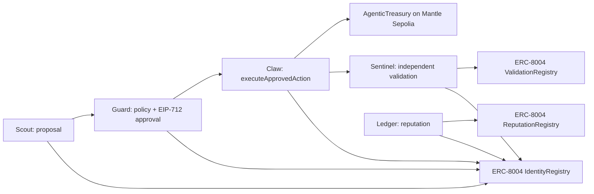

# Pitch Deck Outline

Use this as the source for slides or DoraHacks long description.

## Slide 1 — Agentic Wallet Treasury

Five ERC-8004 agents coordinate treasury decisions on Mantle.

```text
Scout -> Guard -> Claw -> Ledger -> Sentinel
proposal -> risk approval -> execution -> reputation -> validation
```

Links:

- Dashboard: https://ychenfen.github.io/agentic-wallet-treasury/
- GitHub: https://github.com/ychenfen/agentic-wallet-treasury

## Slide 2 — Problem

Agent wallets are easy to demo but hard to trust.

Current demos usually miss:

- durable agent identity
- explicit risk approval
- replay-safe execution authority
- independent validation
- reputation that survives across runs

## Slide 3 — Solution

Agentic Wallet Treasury creates a verifiable agent economy loop.

- ERC-8004 IdentityRegistry gives each agent an on-chain identity.
- Guard signs an EIP-712 `ApprovedAction`.
- Claw executes through `AgenticTreasury`.
- Ledger writes ReputationRegistry feedback.
- Sentinel posts ValidationRegistry request / response evidence.

## Slide 4 — Why Mantle

Mantle is the right environment for agentic wallet economies:

- low-cost execution for repeated agent cycles
- DeFi and RWA narratives that match treasury automation
- ERC-8004 registry deployments already available on Mantle Sepolia
- strong fit with the hackathon's Human vs AI and on-chain benchmarking themes

## Slide 5 — Architecture



## Slide 6 — On-Chain Evidence

Every core claim has a Mantle Sepolia artefact.

- AgenticTreasury: https://sepolia.mantlescan.xyz/address/0x739862c3cf9b5f9fe6a8ecd95e75714a20116fe9
- Treasury execution: https://sepolia.mantlescan.xyz/tx/0xa3d26423e3ab39e4303009d862d2e3f9f6d50fcc8139f93c3d73821999a4ca8a
- Validation request: https://sepolia.mantlescan.xyz/tx/0x652b71548464cdd81913c18ab2cf3a8a691320fa324a3d35416715c90dc448b6
- Validation response: https://sepolia.mantlescan.xyz/tx/0xe4897d7e5fcc38369eb02b374078416612e6b60c4c77226808962421692cca8d
- Full evidence report: https://github.com/ychenfen/agentic-wallet-treasury/blob/main/SUBMISSION_HASHES.md

## Slide 7 — What Judges Should Notice

- This is not just a UI; the evidence is on-chain.
- The system uses all three ERC-8004 surfaces: identity, reputation, validation.
- Risk approval is explicit and signature-based.
- Dashboard reads real event backfills from Mantle Sepolia.
- The pattern generalizes to RWA allocation, DeFi rebalancing, and treasury operations.

## Slide 8 — Roadmap

Near-term:

- hosted agent metadata instead of data URIs
- richer Sentinel validation adapters
- Byreal CLI integration when Mantle-specific Skills are available
- policy marketplace for reusable Guard rules

Long-term:

- production account abstraction wallet integration
- multi-validator agent reputation markets
- RWA / mETH / USDY strategy modules
