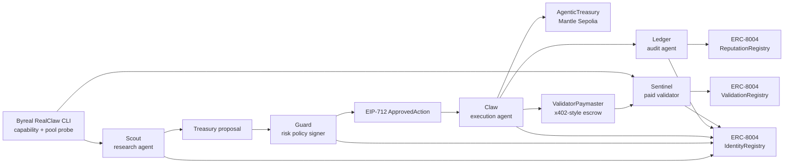

# Project State And Roadmap

Last updated: 2026-05-06

## One-Line Shape

Agentic Wallet Treasury is a five-agent wallet economy on Mantle: Scout
researches, Guard signs risk approval, Claw executes, Ledger writes
reputation, and Sentinel validates the result while earning x402-style MNT
fees.

## Target Awards

Primary:

- **Agentic Economy Track — First Prize**
- **20 Project Deployment Award**

Secondary:

- **Best UI/UX Award**
- **Community Voting**, if we later run distribution well

Grand Champion is possible only if the project also gains stronger Mantle
ecosystem contribution and longer-running live evidence.

## Current Evidence

| Area | Status | Evidence |
|---|---|---|
| Public repo | Done | `https://github.com/ychenfen/agentic-wallet-treasury` |
| Public dashboard | Done | `https://ychenfen.github.io/agentic-wallet-treasury/` |
| Mantle Sepolia deployment | Done | AgenticTreasury + ValidatorPaymaster deployed |
| ERC-8004 identities | Done | 5 real agent IDs on Mantle Sepolia |
| ERC-8004 reputation | Done | ReputationRegistry feedback events backfilled |
| ERC-8004 validation | Done | Validation request/response events backfilled |
| x402-style agent payment | Done | ValidatorPaymaster payment linked to requestHash |
| Byreal capability evidence | Done | Real `byreal-cli` probe, catalog, overview, pool analysis |
| Contract verification package | Prepared | Standard JSON inputs and constructor args generated |
| Draft demo video | Present | `artifacts/video/agentic-wallet-treasury-demo-draft.mp4` |
| Final video | Not done | Needs public YouTube/Loom upload |
| Mainnet run | Not done | Optional later, small amount only |

## Current Architecture

## Why This Fits The Official Rubric

Agentic Economy Track:

- Uses a real Byreal RealClaw CLI probe as Scout/Sentinel research evidence.
- Shows agent autonomy as a multi-agent workflow, not a single chatbot.
- Uses on-chain execution, validation, reputation, and payment.
- Applies the RealClaw expansion path to an everyday use case: an agentic
  treasury / personal CFO wallet.

Grand Champion dimensions:

- **Technical Depth**: ERC-8004 identity, reputation, validation; EIP-712
  treasury approval; Mantle Sepolia events; paymaster escrow.
- **Innovation**: wallet agents earn or lose reputation and validation fees.
- **Mantle Contribution**: demonstrates a reusable pattern for verifiable
  agent wallets on Mantle.
- **Product Completeness**: public dashboard, repo, chain links, runbook,
  pitch deck, draft video.

20 Project Deployment Award:

- Smart contracts deployed on Mantle Sepolia.
- Verification package prepared; browser verification still needs completion.
- Public frontend exists.
- Deployment addresses are in README / evidence report.
- Demo video exists as draft; final public URL still needed.

## What Was Added In The Latest Round

- Added Mantlescan verification preparation:
  - `scripts/prepare-contract-verification.ts`
  - `contracts/verification/*.standard-json-input.json`
  - `contracts/verification/*.constructor-args.txt`
  - `CONTRACT_VERIFICATION.md`
  - `apps/web/public/contract-verification.json`
- Added dashboard panel for Mantlescan verification packages.
- Added preflight check for the verification package.
- Captured official DoraHacks scoring and deployment award rules in
  `hackathon/01-requirements-criteria.md`.

## Immediate Next Steps

1. **Complete Mantlescan browser verification**
   - Open each verify page in `CONTRACT_VERIFICATION.md`.
   - Select Solidity Standard JSON input.
   - Use compiler `v0.8.26+commit.8a97fa7a`.
   - Optimization enabled, runs `200`.
   - Paste the generated JSON and constructor args.

2. **Record final 2+ minute video**
   - Show public dashboard.
   - Show Mantlescan verified contracts.
   - Show ERC-8004 agent IDs.
   - Show Byreal Skills Probe panel.
   - Show one execution tx, one x402 payment tx, one validation response tx.

3. **Submit DoraHacks draft early**
   - Use `DORAHACKS_FORM.md`.
   - Include GitHub, dashboard, contract addresses, and evidence report.
   - Add final video URL once uploaded.

## 40-Day Winning Plan

### Phase 1 — Deployment Award Closure

Goal: qualify for the first-come deployment award.

- Verify AgenticTreasury and ValidatorPaymaster on Mantlescan.
- Update `SUBMISSION_HASHES.md` with verified source links.
- Upload final demo video.
- Submit DoraHacks BUIDL draft.

### Phase 2 — Product Depth

Goal: make the project feel like an actual wallet product.

- Add a clean beginner flow: “what each agent did” in plain English.
- Add a deployment-award checklist on the dashboard.
- Improve mobile layout and screenshot quality.
- Add one-click copy links for contract/tx evidence.

### Phase 3 — Real Mantle DeFi Action

Goal: move beyond treasury self-call demo.

- Add one Mantle protocol adapter.
- Keep the first integration tiny and bounded.
- Show Guard approving a real external protocol target.
- Show Sentinel validating the external action.

### Phase 4 — Optional Mainnet Evidence

Goal: create proof that the architecture can operate outside testnet.

- Use a fresh wallet only.
- Use a small amount, around 20-50 USD equivalent.
- Set hard per-action limits.
- Run a small number of mainnet cycles.
- Never expose or reuse the agent mnemonic.

### Phase 5 — Distribution

Goal: make judges and voters remember the project.

- Write a short technical article.
- Post dashboard screenshots.
- Ask specific Byreal/Mantle questions in official channels.
- Prepare a clean 30-second pitch and a 3-minute technical walkthrough.

## Risk Register

| Risk | Mitigation |
|---|---|
| Mantlescan verification friction | Standard JSON package generated and documented |
| Byreal CLI is Solana-native today | Be explicit: used as real RealClaw capability probe, Mantle execution stays on Mantle |
| Overclaiming alpha/trading | Frame as agentic wallet economy / personal CFO, not profitable trading |
| Mainnet fund risk | Keep optional, small, separate wallet, hard limits |
| Video not ready | Use draft video now; record final after verified contracts |

## Current Position

This is already above the “skeleton hackathon demo” line. The main issue is
not code volume anymore; it is packaging the evidence so judges can verify it
quickly.

The highest-ROI next action is contract verification, then immediate DoraHacks
draft submission for the deployment award.
