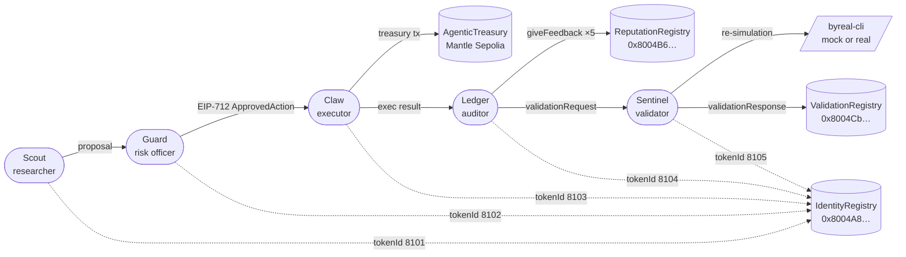

# Mantle Turing Test Hackathon 2026 — Agentic Wallet Treasury

> Agentic Wallet Treasury: five ERC-8004 agents coordinate a Mantle treasury action with policy checks, execution proof, validation, and reputation feedback.
>
> 日期：2026-05-04 · 目标：Track 6 Agentic Wallets & Economy 获奖

## Run

```bash
npm install
npm run demo            # mock adapter, no chain interaction
npm run dev             # http://127.0.0.1:5175/
```

Want the on-chain version? See `DEVELOPMENT.md` for the
`npm run live-demo -- --register --feedback` flow.

## What It Demonstrates

Five ERC-8004 agents share one treasury cycle. Every cycle hits all three
ERC-8004 registries: Identity, Reputation, and Validation.



1. **Scout** proposes a bounded treasury action (1 of 5 scenarios).
2. **Guard** applies policy. If approved, Guard signs an EIP-712
   `ApprovedAction`.
3. **Claw** submits `executeApprovedAction(approval, data, signature)` from
   a different wallet — the contract verifies Guard's signature on chain.
4. **Ledger** writes `giveFeedback` calldata to ERC-8004 ReputationRegistry
   and asks Sentinel to validate Claw's tx.
5. **Sentinel** re-simulates Claw's output (deterministic math, or
   `byreal-cli swap execute --dry-run` when `BYREAL_MODE=real`) and posts a
   `validationResponse` (0–100) to ERC-8004 ValidationRegistry.

Adapters (selected via `EXECUTOR` env): `mock` (default, deterministic),
`byreal` (wraps `byreal-cli`), `mantle-sepolia` (real EIP-712 + on-chain tx).

Scenarios rotate so each `npm run demo` produces a different state — small
stable swap, RWA yield-curve rebalance, oversized action that Guard blocks,
approved action that Sentinel rejects on slippage, no-op hold cycle.

State files (gitignored, regenerated by demo runner / scripts):

| File | Written by | Purpose |
|---|---|---|
| `apps/web/public/demo-run.json` | `npm run demo` | Latest full cycle (rendered by dashboard). |
| `apps/web/public/demo-history.json` | `npm run demo` | Last 20 cycles + cumulative reputation. |
| `apps/web/public/agents/*.json` | `npm run demo` | ERC-8004 registration metadata per agent. |
| `apps/web/public/agent-ids.json` | `npm run register` | Real numeric IDs after on-chain registration. |
| `apps/web/public/deployed-treasury.json` | `npm run deploy-treasury` | Deployed contract record (address, tx, owner). |
| `apps/web/public/live-chain.json` | `npm run poll-chain` | On-chain snapshot of all 5 agents. |
| `apps/web/public/events.json` | `npm run watch-events` | Last 100 ERC-8004 + Treasury events. |
| `apps/web/public/preflight.json` | `npm run preflight` | Submission readiness checks. |

## Command matrix

Live dashboard: https://ychenfen.github.io/agentic-wallet-treasury/

On-chain evidence: [`SUBMISSION_HASHES.md`](./SUBMISSION_HASHES.md)

| Stage | Command | What it does |
|---|---|---|
| 0 — Local demo | `npm run demo` | Pure mock; no chain. Writes demo-run + demo-history. |
| 0 — Dashboard | `npm run dev` | http://127.0.0.1:5175/. |
| 1 — Wallets | `GENERATE_MNEMONIC=1 npm run wallets` | Mints 5-agent mnemonic into `.env.generated`. |
| 1 — Verify env | `npm run preflight` | Read-only health check. |
| 2 — Deploy | `npm run deploy-treasury` | Builds + deploys `AgenticTreasury` to Mantle Sepolia. |
| 2 — Register | `npm run register` | 5 ERC-8004 `register()` txs; writes agent-ids.json. |
| 3 — Run | `EXECUTOR=mantle-sepolia npm run demo` | Real EIP-712 sign + on-chain `executeApprovedAction`. |
| 3 — Feedback | `npm run feedback` | 5 `giveFeedback()` txs; Ledger scores other agents, Sentinel scores Ledger. |
| 3 — Validate | `npm run validate` | `validationRequest` (Claw / subject owner) + `validationResponse` (Sentinel). |
| 4 — Stream | `npm run watch-events` | Continuous event log → dashboard. |
| 4 — Stream | `npm run poll-chain` | Continuous chain snapshot → dashboard. |
| All-in-one | `npm run live-demo -- --deploy --register --feedback --validate --watch` | Full chain rehearsal. |
| 5 — Balance | `npm run balance` | Check MNT balance for every agent wallet. |
| 5 — Report | `npm run report` | Scan all artefacts → write `SUBMISSION_HASHES.md` with mantlescan links. |

For the full operator script see [`RUNBOOK.md`](./RUNBOOK.md).

## 5 分钟读完版（TL;DR）

| 维度 | 结论 |
|---|---|
| 截止日期 | 2026-06-15 23:59，剩 42 天 |
| 奖金池 | Phase 2 $100,000，6 条赛道（Phase 1 已结束） |
| 评委定位 | VC + 数据 + AI infra，不是纯学术——重叙事、重 agent 真实表现 |
| 核心机制 | 链上 benchmarking + ERC-8004 身份 + 全球直播 |
| 当前选择 | **#6 Agentic Wallets & Economy** |
| 当前项目 | **Agentic Wallet Treasury** |
| 当前状态 | 已完成 Mantle Sepolia treasury deploy、5 个 ERC-8004 agentId、reputation、validation、事件回填 |

## Code Layout

```
apps/agents/      multi-agent demo runner (mock / byreal / mantle-sepolia adapters)
apps/web/         live dashboard
packages/core/    ERC-8004 addresses + ABI, agent types, wallets, executors
contracts/        AgenticTreasury (EIP-712 risk approval) + Foundry tests
scripts/          register-agents / write-feedback / verify-agents / live-demo
strategy/         winning plan and research notes
hackathon/        official overview and requirements capture
```

## 关键数字 / 地址速查

```
Mantle Mainnet Chain ID:       5000
Mantle Sepolia Block Explorer: sepolia.mantlescan.xyz
ERC-8004 Identity (Mantle):    0x8004A169FB4a3325136EB29fA0ceB6D2e539a432
ERC-8004 Reputation (Mantle):  0x8004BAa17C55a88189AE136b182e5fdA19dE9b63
ERC-8004 Validation (Mantle):  0x8004Cc8439f36fd5F9F049D9fF86523Df6dAAB58
ERC-8004 Identity (Sepolia):   0x8004A818BFB912233c491871b3d84c89A494BD9e
ERC-8004 Reputation (Sepolia): 0x8004B663056A597Dffe9eCcC1965A193B7388713
ERC-8004 Validation (Sepolia): 0x8004Cb1BF31DAf7788923b405b754f57acEB4272
Byreal CLI npm 包:             @byreal-io/byreal-cli
Byreal Skills GitHub:          github.com/byreal-git/byreal-agent-skills
ERC-8004 contracts GitHub:     github.com/erc-8004/erc-8004-contracts
```

## Development Docs

- `SUBMISSION.md` — DoraHacks BUIDL fields, demo script, and award strategy.
- `PROGRESS.md` — current completed work, verification status, and next steps.
- `DEVELOPMENT.md` — commands and next engineering steps.
- `strategy/05-winning-plan.md` — track choice and winning strategy.
- `hackathon/01-requirements-criteria.md` — paste official DoraHacks rubric here.

## 研究资料阅读顺序

1. `hackathon/00-overview.md` —— 5 分钟，了解全局
2. `strategy/05-winning-plan.md` —— 当前执行方案
3. `strategy/04-strategy-and-next-steps.md` —— 原始赛道分析
4. `tracks/T6-agentic-wallets.md` —— 赛道 6 深入
5. `erc-8004/03-erc8004.md` + `byreal/02-byreal-realclaw.md` —— 实操前再读一遍
6. `mantle/01-mantle-stack.md` —— 写代码时随时回查
